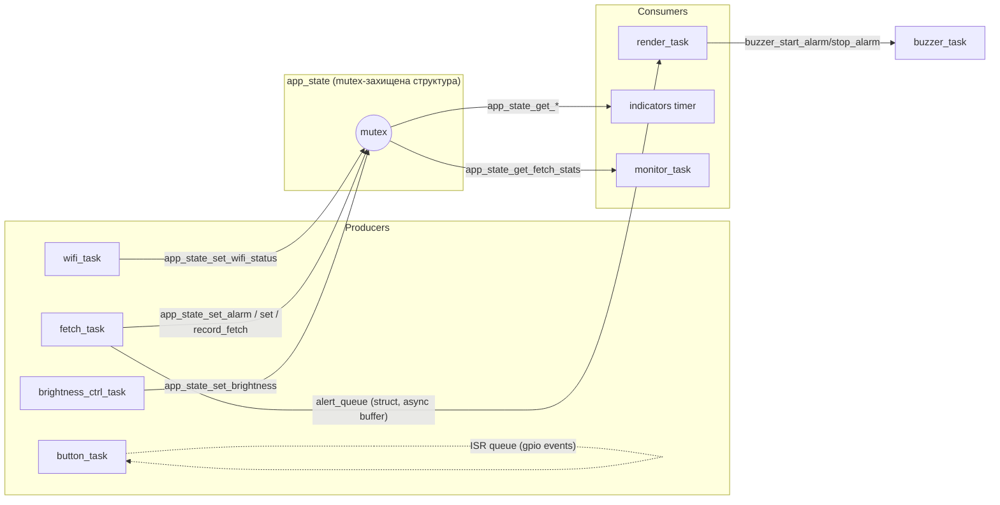
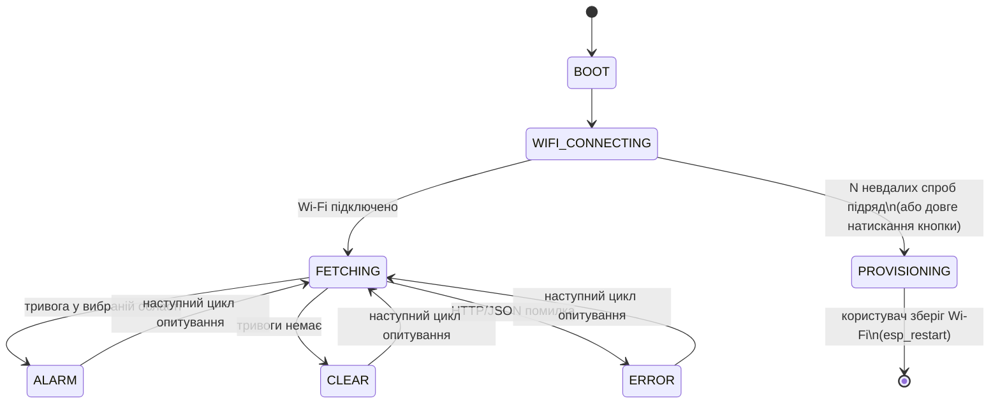
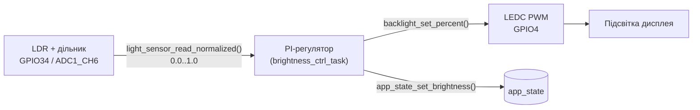
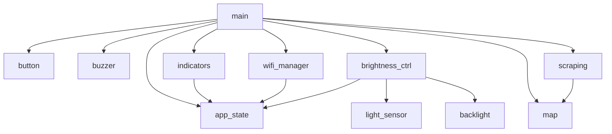

# Архітектура

## 1. Чому RTOS, а не superloop

Пристрою потрібно одночасно: тримати Wi-Fi (з перепідключенням), періодично
опитувати зовнішнє REST API (мережевий I/O з тайм-аутами до 10с), малювати на
дисплеї, регулювати яскравість підсвітки за датчиком світла кожні ~0.5с,
реагувати на кнопку без затримки і керувати зумером — без того, щоб повільна
операція (HTTP-запит) блокувала швидку (регулювання яскравості, кнопка).
Один superloop із чергою `if`-ів або з `delay()` не дав би цього без
кооперативної диспетчеризації, яку FreeRTOS вже надає готовою. Тому вибір —
**FreeRTOS (RTOS)**, з окремою задачею на кожну незалежну відповідальність.

## 2. Задачі (FreeRTOS tasks)

| Задача | Компонент | Пріоритет | Блокується на | Головна робота |
|---|---|---|---|---|
| `wifi_task` | wifi_manager | 4 | event group (тайм-аут) | підключення/перепідключення Wi-Fi, backoff, auto-provisioning |
| `fetch_task` | main | 4 | `vTaskDelay` (період опитування) | HTTP GET + JSON-парсинг, шле у `alert_queue` |
| `render_task` | main | 5 | `xQueueReceive(alert_queue)` | єдиний "письменник" framebuffer/дисплей |
| `button_task` | button | 5 | `xQueueReceive` (ISR events) | дебаунс + вимірювання тривалості натискання |
| `buzzer_task` | buzzer | 4 | `xQueueReceive` (команди) | неблокуюча сирена/біп |
| `brightness_ctrl_task` | brightness_ctrl | 3 | `vTaskDelay` (період регулятора) | PI-регулятор яскравості за датчиком світла |
| `monitor_task` | main | 1 | `vTaskDelay` (30с) | CPU usage stats, watchdog-звіт |
| `indicators` (esp_timer callback) | indicators | — | апаратний таймер | блимання Status/Wi-Fi LED |

Мінімум "2 tasks" із п.3.1 виконано з запасом (7 задач + 1 періодичний
таймер). Кожна задача, що виконує повторювану роботу, підписана на **Task
Watchdog Timer** (`esp_task_wdt_add` + періодичний `esp_task_wdt_reset`) —
якщо якась задача зависне, пристрій сам перезавантажиться (п.5.1).

## 3. Синхронізація

- **Mutex** (`app_state`, `SemaphoreHandle_t`) — єдина точка правди про стан
  системи (Wi-Fi статус, чи активна тривога, яка область, яскравість,
  статистика останнього опитування). Пишуть у неї 3 різні задачі, читають —
  ще 3 інші. Критичні секції короткі (лише memcpy кількох полів), тайм-аут
  очікування mutex — 200мс (див. `app_state.c`), щоб зависання одного
  читача/писача було помітним у логах, а не тихим deadlock.
- **Queue** використано двічі, з різним призначенням:
  - `button` ISR → `button_task` (сирі події зміни рівня GPIO);
  - `fetch_task` → `render_task` (`alert_queue`, готовий результат циклу
    опитування — це і є "асинхронна передача даних" з п.2.4/3.2).
  - `buzzer` командна черга (`buzzer_task` чекає команд start/stop/beep).
- Жодна задача не читає/пише framebuffer дисплея, крім `render_task` —
  тому для нього окремий mutex не потрібен (єдиний писар за конструкцією,
  а не за домовленістю).

## 4. Діаграма станів (`app_state_t`)

`app_state_set()` (у `components/app_state`) логує кожен перехід
(`state: X -> Y`), що зручно і для налагодження, і як "живий" доказ роботи
state machine під час демонстрації (п.9.3).

## 5. Дані датчика світла → підсвітка (feedback control, п.4.1/4.2)

`setpoint = min + lux*(max-min)`, `error = setpoint - поточна_яскравість`,
далі класичний PI із анти-windup (обмеження інтегральної складової) і
насиченням виходу в межах `[MIN, MAX]` (Kconfig). Деталі й коефіцієнти —
`components/brightness_ctrl/brightness_ctrl.c`.

## 6. Граф залежностей компонентів

Компоненти навмисно розбиті так, щоб не було циклів, і кожен ізольований
модуль (`button`, `buzzer`, `backlight`, `light_sensor`, `map`) не знав нічого
про решту системи — вони отримують дані через параметри функцій або нічого
не знають про `app_state` взагалі.

## 7. Відображення на дисплеї

`render_task` — єдина задача, що малює. Три режими одного й того самого
framebuffer (`components/map/map_render.c`, вже існували раніше, зараз лише
використані усвідомлено як частина state machine):
- `render_map()` — тривоги немає, штрихована мапа (ідле-екран);
- `render_map_multicolor()` + `render_mark_regions_red()` — тривога:
  всі активні області з відповіді API підсвічуються червоним;
- `render_draw_err_banner()` — помилка HTTP/JSON.

## 8. Відомі свідомі спрощення (не приховуємо)

- `wifi_manager_start_provisioning()` можна викликати і з довгого натискання
  кнопки, і автоматично з `wifi_task` після N невдалих спроб — обидва шляхи
  не координуються через окрему чергу/семафор (в оригінальному коді цей же
  ризик уже був). Малоймовірна гонитва при одночасному спрацюванні обох
  тригерів не призводить до пошкодження даних (лише до зайвого логу),
  оскільки `s_provisioning_active` перевіряється перед стартом SoftAP.
- Один HTTP-буфер (8КБ, `static` у `fetch_task`) виділений один раз назавжди,
  а не на кожен цикл — свідомо, щоб уникнути фрагментації купи (heap) і
  повторних malloc/free (п.6.3).
