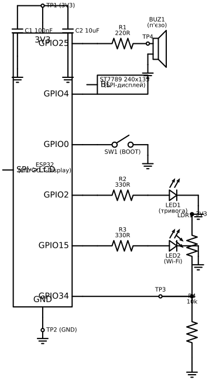

# Апаратна частина / PCB

> **Статус:** зроблена принципова схема (`docs/hardware/schematic.svg`). Плата
> **не розведена і не виготовлена** — за домовленістю обсяг роботи в цій
> переробці обмежено схемою й аргументацією рішень, без 2-шарового розведення
> та виготовлення (пункти 7.2 і 7.7 чек-листа залишаються невиконаними
> свідомо, решта пунктів розділу 7 нижче аргументовано на рівні схеми).

## Схема

Схема існує у двох форматах (зміст ідентичний, файли синхронізовані):

- **`docs/hardware/schematic.svg`** — векторний, можна відкрити просто в
  браузері чи Inkscape без встановлення жодного ПЗ. Згенерований програмно
  (Python + schemdraw); скрипт не входить у прошивку, це лише допоміжний
  інструмент документації.
- **`docs/hardware/alertinua.kicad_sch`** — та ж сама схема як справжній
  проєкт **KiCad** (+ `alertinua.kicad_pro`, `alertinua.kicad_sym`,
  `sym-lib-table`). Відкривається в KiCad 7/8/9/10 (новіші версії самі
  підвищують формат файлу при відкритті). Це дозволяє реально погратись зі
  схемою в КАД-редакторі (переміщати елементи, запустити ERC, за бажання
  почати розведення), а не лише дивитись на картинку.

> **Чесно про перевірку:** `.kicad_sch`-файл згенеровано програмно (Python),
> без доступу до графічного KiCad у цьому середовищі. Синтаксис
> S-виразів звірявся напряму з реальними файлами пакетів `kicad-symbols` й
> `kicad-templates` (символи R/C/LED/R_Photo/Speaker/SW_Push/GND/+3V3 взяті
> вербатим), а сам файл пройшов автоматичну перевірку: баланс дужок,
> парсинг незалежною бібліотекою `kiutils` (парсить і серіалізує назад без
> помилок), унікальність усіх UUID, та власну перевірку, що кожен пін кожної
> деталі дійсно з'єднаний дротом (жодного "висячого" піна чи випадкового
> дотику одного дроту до середини іншого). Попри це, **відкрийте файл у
> своєму KiCad і погляньте самостійно** перед захистом — автоматична
> перевірка синтаксису не замінює візуальний огляд у реальному редакторі.

## Що на схемі

| Позначення | Що це | GPIO | Примітка |
|---|---|---|---|
| BUZ1 | П'єзозумер | GPIO25 (LEDC, PWM) | R1 (220R) обмежує струм через п'єзоелемент |
| ST7789 (BL) | Підсвітка дисплея | GPIO4 (LEDC, PWM) | керується `brightness_ctrl` (feedback-регулятор) |
| SW1 | Кнопка входу в налаштування Wi-Fi | GPIO0 | вбудована BOOT-кнопка плати, зовнішня не потрібна |
| LED1 | Індикатор тривоги | GPIO2 | блимає, поки тривога активна |
| LED2 | Індикатор Wi-Fi | GPIO15 | горить постійно / блимає / вимкнено залежно від статусу |
| LDR1 + R4 | Дільник напруги з фоторезистором (датчик освітлення) | GPIO34 (ADC1_CH6) | новий сенсор, живить контур автояскравості |
| C1, C2 | Розв'язувальні конденсатори на 3V3 | — | 100nF (високочастотні викиди) + 10uF (низькочастотні) |
