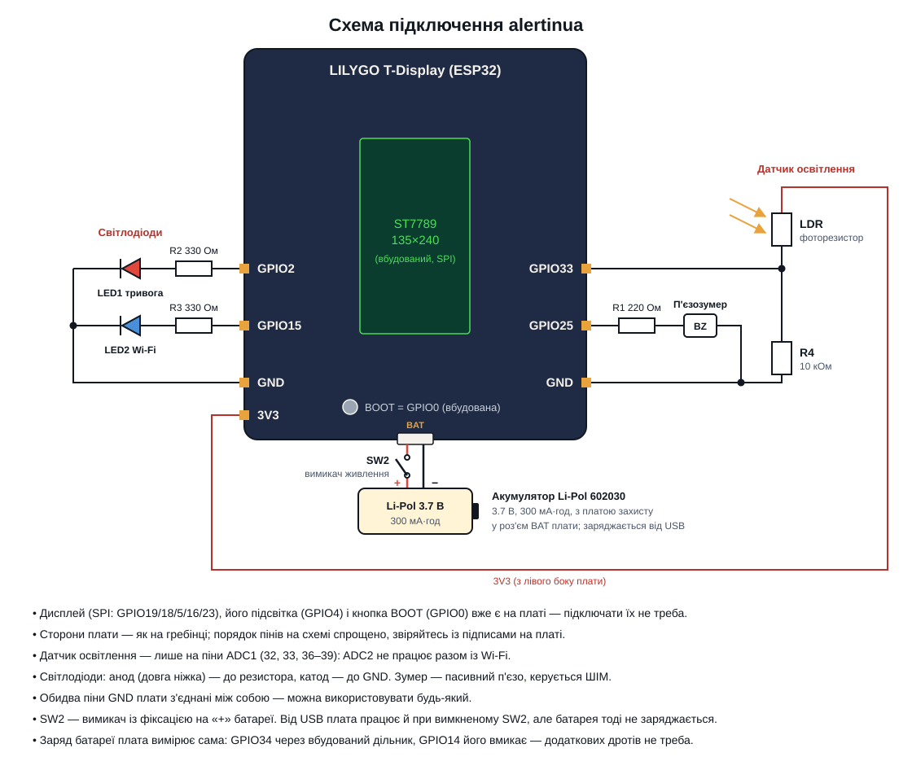

# Апаратна частина

## Схема підключення

`docs/wiring.svg` — схема з'єднань зовнішніх деталей з гребінкою LILYGO
T-Display. Дисплей, його підсвітка й кнопка BOOT уже є на платі.
Принципова схема в KiCad — у роботі.

## Що на схемі

| Позначення | Що це | GPIO | Примітка |
|---|---|---|---|
| BUZ1 | П'єзозумер | GPIO25 (LEDC, PWM) | R1 (220R) обмежує струм через п'єзоелемент |
| ST7789 (BL) | Підсвітка дисплея | GPIO4 (LEDC, PWM) | вбудована; керується `brightness_task` (ПІ-регулятор) |
| SW1 | Кнопка входу в налаштування Wi-Fi | GPIO0 | вбудована BOOT-кнопка плати, зовнішня не потрібна |
| LED1 + R2 | Індикатор тривоги | GPIO2 | R2 330 Ом обмежує струм; блимає, поки тривога активна |
| LED2 + R3 | Індикатор Wi-Fi | GPIO15 | R3 330 Ом; горить постійно / блимає / вимкнено залежно від статусу |
| LDR1 + R4 | Дільник напруги з фоторезистором (датчик освітлення) | GPIO33 (ADC1_CH5) | R4 10 кОм; ADC1, бо ADC2 не працює разом із Wi-Fi |
| SW2 | Вимикач живлення з фіксацією | — | у розриві червоного проводу «+» між акумулятором і роз'ємом BAT; при вимкненому SW2 плата живиться лише від USB, батарея не заряджається |
| BAT1 | Акумулятор Li-Pol 602030, 3.7 В, 300 мА·год, з платою захисту | GPIO34 (ADC1_CH6), GPIO14 | у штатний роз'єм BAT; заряджає вбудований контролер від USB. Напругу плата подає на GPIO34 через дільник 100к/100к, дільник вмикається HIGH на GPIO14 |
