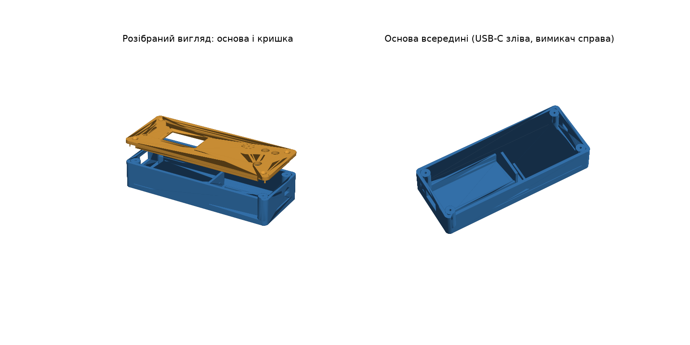
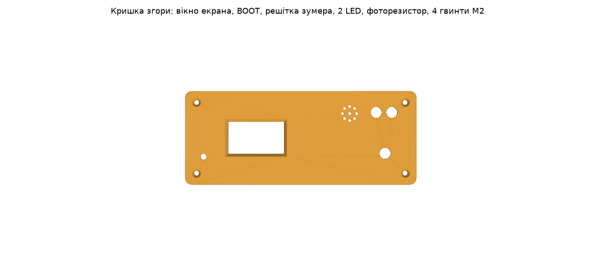

# Корпус alertinua для 3D-друку



Корпус 104 × 42 × 20 мм із двох частин на 4 гвинтах M2:

- **основа** — напрямні під LILYGO T-Display, місце під акумулятор 602030,
  отвір під USB-C (зліва), проріз під вимикач SS-12D00 (справа), 4 стійки
  під саморізи M2;
- **кришка** — вікно екрана з фаскою, отвір ⌀3 мм до кнопки BOOT, 2 отвори
  під світлодіоди 5 мм, отвір під фоторезистор 5 мм, решітка й тримач
  зумера ⌀12 мм, посадковий бортик.



## Файли

| Файл | Для чого |
| --- | --- |
| `alertinua_base.stl`, `alertinua_lid.stl` | слайсер; вже в положенні для друку (основа дном, кришка лицем на столі) |
| `alertinua_case.FCStd` | редагування у FreeCAD |
| `alertinua_base.step`, `alertinua_lid.step` | інші CAD-програми |
| `alertinua_case.py` | параметричний скрипт, з якого згенеровано все вище |

## Перед друком — виміряти

Ці розміри в скрипті — оцінки (позначені `ВИМІРЯТИ`). Звірте їх
штангенциркулем, змініть у `alertinua_case.py` і перегенеруйте:

1. `DISP_CX`, `DISP_CY` — центр екрана на платі (найважливіше).
2. `BOOT_X`, `BOOT_Y` — положення кнопки BOOT.
3. `USB_CZ` — висота роз'єму USB-C над дном (отвір має запас).
4. `BUZ_D` — діаметр зумера (зараз 12 мм).
5. `BATT_L` — довжина акумулятора разом із платою захисту (зараз 34 мм).

Перегенерувати:

```
freecadcmd alertinua_case.py
```

Файли з'являться в папці `out/` поруч зі скриптом.

## Друк

PLA або PETG, шар 0.2 мм, заповнення 20 %, без підтримок. Спершу варто
надрукувати лише кришку й приміряти до плати — це швидко покаже, чи
правильно стоїть вікно екрана.
